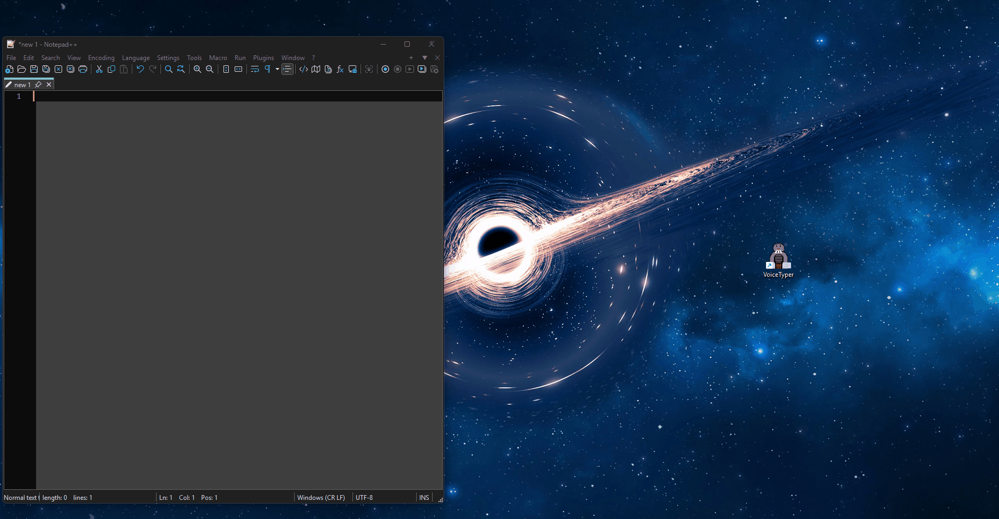

# VoiceTyper

VoiceTyper aspires to be a fast, lightweight, native, fully-local and offline dictation application.
As a standalone program, it can be used to input text directly from your voice into other 
desktop applications such as your web browser, note taking app, or even messaging
app that doesn't have a voice input feature. 

> [!NOTE]
> LLMs are used to generate code for this project, more info at bottom of README.

## Dependencies
Sources copied directly into the repo:

[whisper.cpp](https://github.com/ggml-org/whisper.cpp)
- This project would not be feasible without this external external dependency.
- Anytime we update our snapshot of whisper.cpp we will make a copy of their sourcetree into this repo.
- Notably, whisper.cpp also depends on [ggml](https://github.com/ggml-org/ggml)
    - ggml version of the whisper and vad models are used

[Dear ImGui](https://github.com/ocornut/imgui)
- Our UI lib of choice.
- Originally used [Qt](https://www.qt.io/development/qt-framework) for the ui, but wanted something simpler that we could just embed into the project source.

## Getting Started
Currently we only target Windows OS.
Precompiled binary releases are available via GitHub Releases.

To compile the project for yourself, you will need:
- C++ compiler toolchain (e.g. Visual Studio 17 2022 MSVC)
- `cmake` (e.g. 3.31.6)
Optional
- NVIDIA CUDA toolkit (e.g. v13.2)

To download ggml whisper models, get them from huggingface [here](https://huggingface.co/ggerganov/whisper.cpp/tree/main), or use the in-app **Download Models...** button (next to the STT model selector) to fetch them automatically. Released builds no longer bundle STT model weights.

## CUDA Support
The CUDA build ships kernels for the following NVIDIA GPU architectures:

| Architecture | sm_xx | Consumer GPUs |
| --- | --- | --- |
| Turing | 75 | RTX 20-series, GTX 16-series |
| Ampere | 86 | RTX 30-series |
| Ada Lovelace | 89 | RTX 40-series |
| Blackwell | 120 | RTX 50-series |

Turing and Ampere are built as PTX (JIT-compiled on first run on any newer GPU), so the binary is forward-compatible with future architectures. Ada and Blackwell are built as pre-compiled SASS to avoid the JIT cost on the most common current cards.

**Driver requirement**: CUDA 13.x requires an NVIDIA driver from the R575 branch or newer on Windows. Older drivers will fail at CUDA initialization with `cudaErrorInsufficientDriver`, regardless of GPU model.

**Older GPUs not supported**: Maxwell (GTX 900-series), Pascal (GTX 1000-series), and Volta (V100) are not compatible with the CUDA 13.x toolkit and are not included in the build. Users with these GPUs should use the CPU build instead.

To customize the architecture list at build time, pass `-DCMAKE_CUDA_ARCHITECTURES=<list>` to cmake. See the [CMake CUDA_ARCHITECTURES documentation](https://cmake.org/cmake/help/latest/prop_tgt/CUDA_ARCHITECTURES.html) for the format.

## LLM Usage Disclaimer:
LLMs are used to write code in this project with human review done at our discretion.

LLM Coding Agent Harnesses Used:
[OpenCode](https://github.com/anomalyco/opencode),
[Codex](https://github.com/openai/codex),
[Claude Code](https://code.claude.com/docs/en/overview)

LLMs Used:
[GLM 5.3](https://z.ai/blog/glm-5.3),
[GLM 5.2](https://z.ai/blog/glm-5.2),
[Kimi K3](https://www.kimi.com/ai-models/kimi-k3),
[OpenCode Zen Big Pickle](https://grokipedia.com/page/Big_Pickle_model),
[Claude Opus 4.6](https://www.anthropic.com/news/claude-opus-4-6),
[Claude Sonnet 4.6](https://www.anthropic.com/news/claude-sonnet-4-6),
[OpenAI GPT-5.5](https://platform.openai.com/docs/models/gpt-5.5)